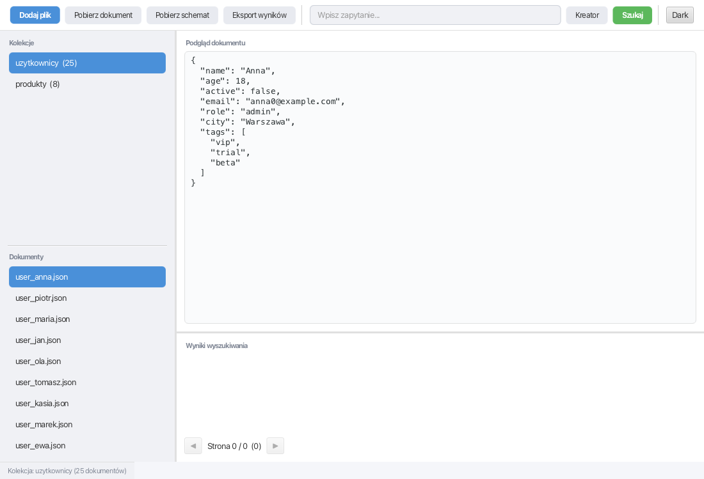
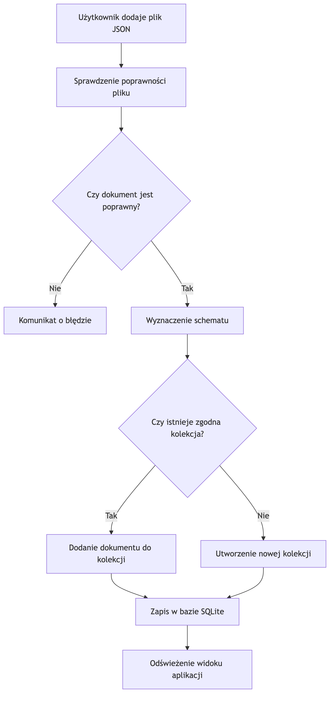
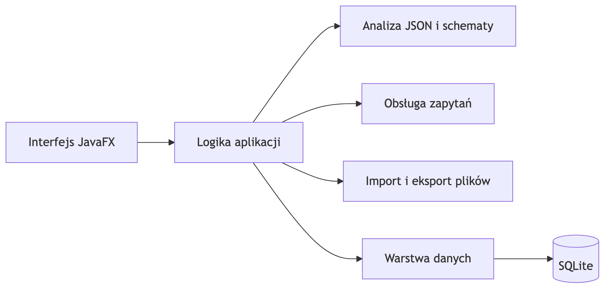
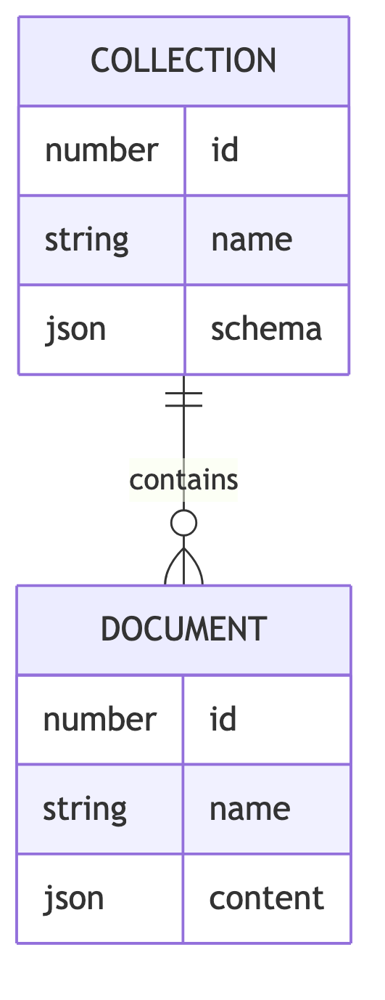
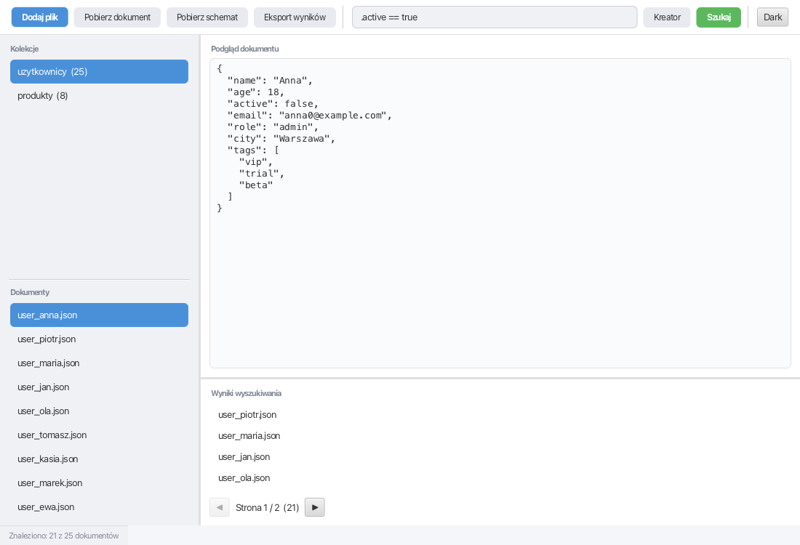
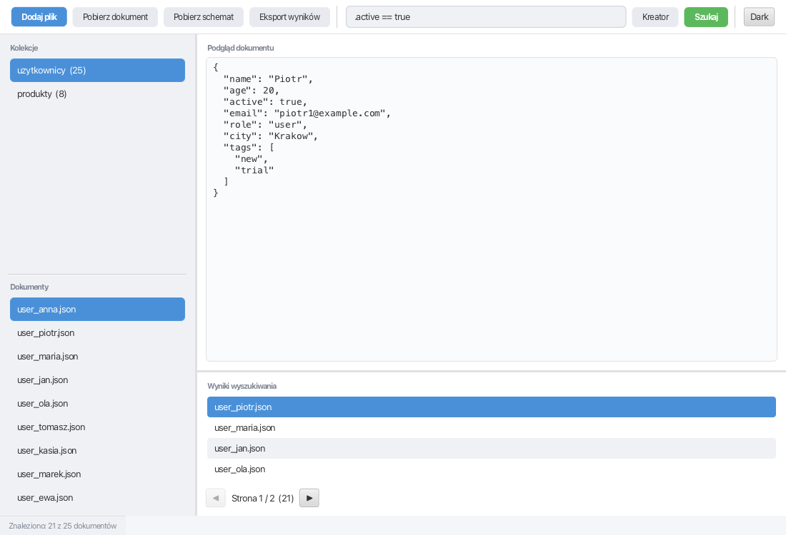
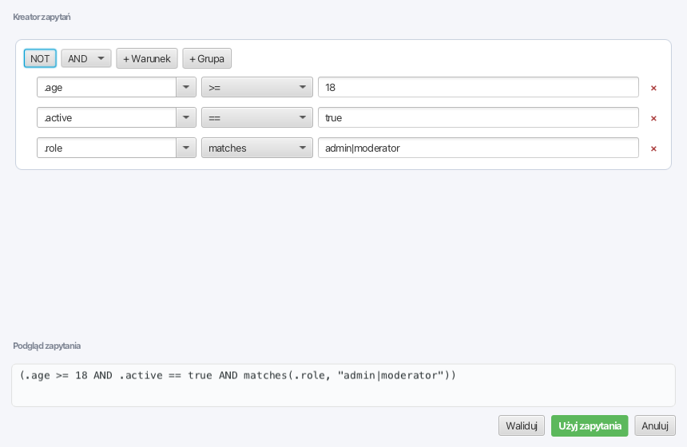

# JSON Insight

JSON Insight to desktopowa aplikacja JavaFX do porządkowania, opisywania i
przeszukiwania dokumentów JSON. Program pomaga pracować z wieloma plikami,
które mają różne struktury albo pochodzą z różnych źródeł.

Po dodaniu pliku aplikacja sprawdza, czy dokument jest poprawnym JSON-em,
wyznacza jego schemat, przypisuje go do kolekcji o zgodnej strukturze i zapisuje
dane lokalnie. Zebrane dokumenty można potem przeglądać, filtrować prostym
językiem zapytań oraz eksportować.



Ten plik README jest główną dokumentacją projektu. Zawiera informacje potrzebne
do uruchomienia aplikacji, zrozumienia jej działania i korzystania z
najważniejszych funkcji.

## Cel aplikacji

JSON Insight rozwiązuje problem pracy z zestawem luźnych plików JSON. Bez takiego
narzędzia trudno szybko sprawdzić, które dokumenty mają ten sam kształt danych,
jakie pola występują w plikach i które rekordy spełniają wybrane warunki.

Aplikacja zapewnia:

- walidację dodawanych dokumentów JSON,
- automatyczne grupowanie dokumentów według schematu,
- podgląd dokumentów i schematów kolekcji,
- wyszukiwanie danych przez zapytania podobne do SQL,
- wizualny kreator zapytań,
- eksport dokumentów, schematów i wyników wyszukiwania,
- lokalne przechowywanie danych w SQLite.

## Najważniejsze pojęcia

**Dokument** to pojedynczy plik JSON dodany do aplikacji.

**Schemat** to opis struktury dokumentu: typy danych, pola obiektu, elementy
tablic i wymagane właściwości.

**Kolekcja** to grupa dokumentów o tym samym schemacie. Użytkownik widzi kolekcje
jako logiczne zestawy podobnych plików.

**Zapytanie** to tekstowy lub wygenerowany w kreatorze warunek, który wybiera
dokumenty spełniające określone kryteria.

## Przepływ dodawania dokumentu

<p align="center"></p>

Kolekcja powstaje wtedy, gdy dodany dokument nie pasuje do żadnego znanego
schematu. Jeżeli struktura dokumentu jest już znana, plik trafia do istniejącej
kolekcji. Dzięki temu użytkownik nie musi ręcznie katalogować dokumentów według
ich formatu.

## Architektura

Projekt jest podzielony na kilka obszarów odpowiedzialności. Interfejs zbiera
akcje użytkownika, logika aplikacji koordynuje operacje, przetwarzanie JSON
odpowiada za strukturę danych, obsługa zapytań filtruje dokumenty, a warstwa
danych zapisuje informacje lokalnie.

<p align="center"></p>

Główne odpowiedzialności:

- **Interfejs JavaFX** prezentuje kolekcje, dokumenty, podgląd treści, wyniki
  wyszukiwania, kreator zapytań i akcje eksportu.
- **Logika aplikacji** łączy operacje użytkownika z przetwarzaniem danych.
- **Analiza JSON i schematy** sprawdzają poprawność dokumentu oraz określają jego
  strukturę.
- **Obsługa zapytań** interpretuje warunki wyszukiwania i wybiera pasujące
  dokumenty.
- **Import i eksport plików** odpowiada za wczytywanie JSON oraz zapis wyników.
- **Warstwa danych** przechowuje kolekcje, schematy i dokumenty w lokalnej bazie.

## Przechowywanie danych

Dane aplikacji są zapisywane lokalnie w bazie SQLite:

```text
~/.jsoninsight/jsoninsight.db
```

Baza jest tworzona automatycznie przy pierwszym uruchomieniu. Użytkownik nie musi
jej zakładać ani konfigurować.

Model przechowywania danych wygląda następująco:

<p align="center"></p>

Kolekcja przechowuje nazwę i schemat. Dokument przechowuje nazwę, treść JSON oraz
powiązanie z kolekcją. Taki podział pozwala szybko pokazać listę dokumentów w
ramach wybranej kolekcji i porównywać nowe pliki z istniejącymi schematami.

## Interfejs użytkownika

Aplikacja składa się z kilku głównych obszarów:

- pasek narzędzi z akcjami importu, eksportu, kreatora zapytań i motywu,
- panel kolekcji i dokumentów,
- podgląd wybranego dokumentu albo schematu,
- pole zapytania,
- tabela wyników wyszukiwania,
- pasek statusu.

Typowy przebieg pracy:

1. Użytkownik dodaje jeden lub wiele plików JSON.
2. Aplikacja waliduje pliki i przypisuje je do kolekcji.
3. Użytkownik wybiera kolekcję lub dokument z listy.
4. Aplikacja pokazuje schemat kolekcji albo sformatowaną treść dokumentu.
5. Użytkownik wpisuje zapytanie lub buduje je w kreatorze.
6. Wyniki można przeglądać, stronicować i eksportować.


## Dodawanie dokumentów

Dokument można dodać przez przycisk w interfejsie albo przez przeciągnięcie pliku
do okna aplikacji. Obsługiwane są pliki `.json`.

Jeśli plik nie jest poprawnym JSON-em, aplikacja pokazuje błąd i nie zapisuje
dokumentu. Jeśli plik jest poprawny, aplikacja wyznacza schemat i sprawdza, czy
pasuje on do istniejącej kolekcji.

Gdy schemat jest nowy, użytkownik nadaje nazwę nowej kolekcji. Gdy schemat jest
już znany, dokument zostaje dodany do pasującej kolekcji automatycznie.

## Wyszukiwanie

Wyszukiwanie służy do filtrowania dokumentów zapisanych w aplikacji. Zapytanie
może wskazywać pola do pokazania oraz warunki, które dokument musi spełnić.

Podstawowa forma:

```sql
SELECT <pola> FROM <kolekcja> WHERE <warunek>
```

Przykłady:

```sql
SELECT * FROM uzytkownicy WHERE .age >= 18 AND .active == true
SELECT .name, .role FROM uzytkownicy WHERE .role == "admin"
SELECT * FROM uzytkownicy WHERE .email EXISTS AND .email IS STRING
SELECT .name, .city FROM uzytkownicy WHERE matches(.role, "admin|moderator")
```

Zapytania wspierają:

- wybór całych dokumentów albo wybranych pól,
- ścieżki do pól JSON w formie `.pole` lub `.obiekt.pole`,
- porównania `==`, `!=`, `>`, `>=`, `<`, `<=`,
- operatory logiczne `AND`, `OR`, `NOT`,
- nawiasy do grupowania warunków,
- sprawdzanie istnienia pola przez `EXISTS`,
- sprawdzanie typu przez `IS`,
- dopasowanie tekstu przez funkcję `matches()`,
- sprawdzanie rozmiaru przez funkcję `size()`.



Wybranie wyniku pokazuje pełną treść pasującego dokumentu w podglądzie.



## Kreator zapytań

Kreator zapytań jest przeznaczony dla użytkowników, którzy nie chcą pisać
zapytań ręcznie. Pozwala budować warunki z gotowych elementów:

- wybór pola,
- wybór operatora,
- wpisanie wartości,
- łączenie warunków przez `AND` i `OR`,
- tworzenie grup warunków,
- negowanie grupy przez `NOT`,
- podgląd wygenerowanego zapytania.

Kreator nie zmienia logiki wyszukiwania. Jest alternatywnym sposobem utworzenia
tego samego zapytania, które można wpisać ręcznie.



## Eksport

Aplikacja pozwala zapisać na dysku:

- wybrany dokument jako `.json`,
- schemat wybranej kolekcji jako `.json`,
- wyniki wyszukiwania jako `.jsonl` albo `.csv`.

Format eksportu wyników jest wybierany na podstawie rozszerzenia pliku. Eksport
obejmuje aktualny zestaw wyników, a nie tylko elementy widoczne na jednej stronie.

## Wymagania

Do uruchomienia projektu potrzebne są:

- JDK 21,
- Maven Wrapper dołączony do repozytorium,
- system Windows, Linux albo macOS.

Nie trzeba instalować osobnej bazy danych. SQLite działa lokalnie razem z
aplikacją.

## Uruchomienie

Z katalogu głównego projektu:

```bash
# Linux lub macOS
./mvnw clean javafx:run

# Windows
mvnw.cmd clean javafx:run
```

Testy:

```bash
# Linux lub macOS
./mvnw test

# Windows
mvnw.cmd test
```

Kompilacja bez uruchamiania aplikacji:

```bash
# Linux lub macOS
./mvnw clean compile

# Windows
mvnw.cmd clean compile
```

## Technologie

Projekt wykorzystuje:

- Java 21,
- JavaFX 21,
- SQLite,
- Gson,
- Lombok,
- JUnit 5,
- Maven.
